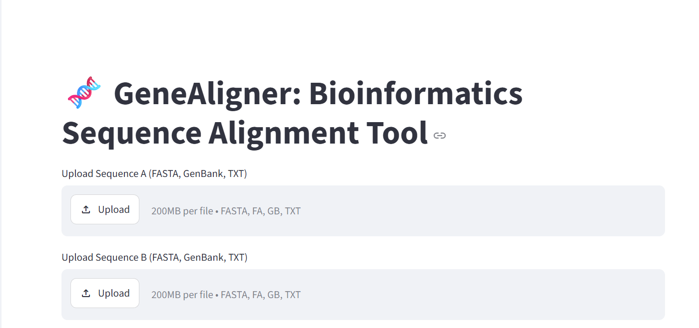
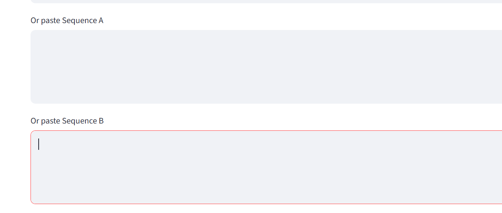
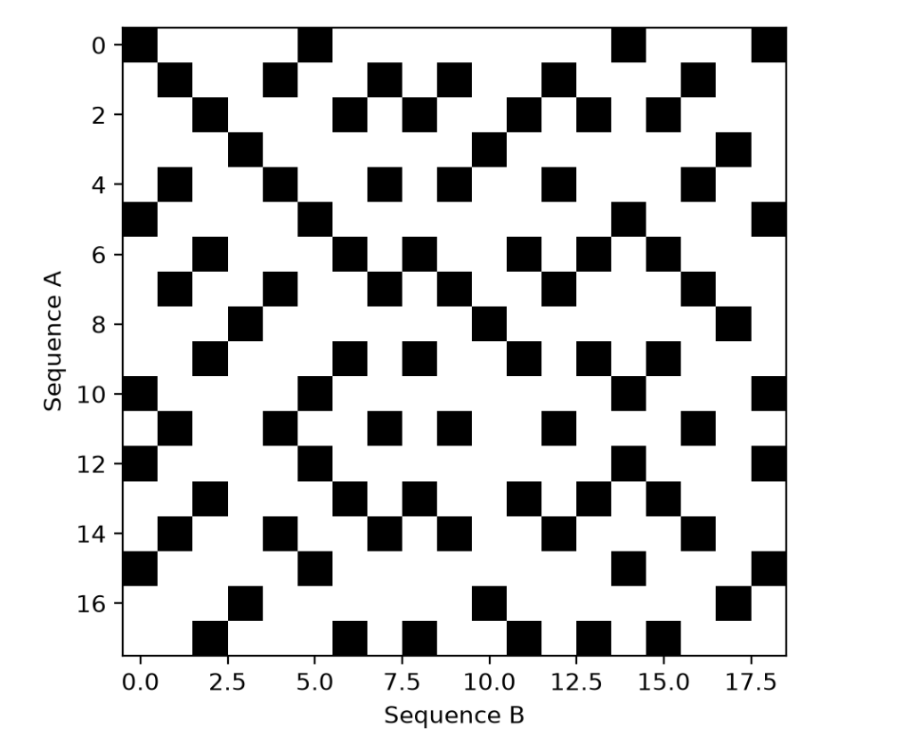
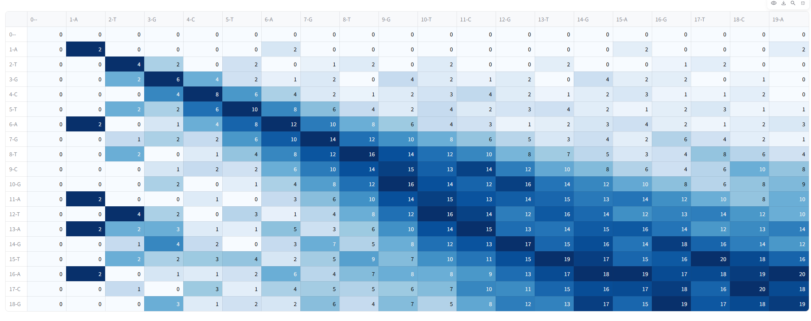

<h1 align="center">🧬 GeneAligner</h1>
<p align="center"><b>Interactive Sequence Alignment Tool for DNA & RNA</b></p>

<p align="center">
  
  
  
  
</p>

<p align="center"><i>Created by Bano Rani — for educational purposes</i></p>

---

## 📖 Overview

**GeneAligner** is a beginner-friendly bioinformatics web app built with **Streamlit** that helps users perform and visualize **DNA/RNA sequence alignments** using multiple classic alignment techniques:

| Method | Type | Description |
|---|---|---|
| 🔹 Dot Matrix | Visual | Graphical comparison of sequence similarity |
| 🔹 Needleman-Wunsch | Global Alignment | Aligns sequences end-to-end |
| 🔹 Smith-Waterman | Local Alignment | Finds best matching subsequences |
| 🔹 Word Method | Heuristic | Fast approximate alignment via k-mer matching |

---

## 📸 Preview

<p align="center">
  
  &nbsp;&nbsp;
  
</p>
<p align="center"><sub>Left: Sequence upload &nbsp;|&nbsp; Right: Sequence Input</sub></p>
---

## 🚀 Features

- ✅ Upload or type DNA/RNA sequences
- ✅ Clean and validate sequences automatically
- ✅ Choose from multiple alignment algorithms
- ✅ Visualize alignment steps and scoring matrices
- ✅ Download or copy alignment results

---

## 🧠 Use Cases

- 🧬 Teaching bioinformatics alignment concepts
- 🧪 Practicing global vs. local alignment
- 👩‍🏫 Classroom demos for biology students
- 💻 Hands-on project for beginners in bioinformatics

---

## Visual Result

<p align="center">
  
  &nbsp;&nbsp;
  
  
  

</p>

---

## 🛠️ Installation

**1. Clone the repository**
```bash
git clone https://github.com/yourusername/gene-aligner-app.git
cd gene-aligner-app
```

**2. Create a virtual environment (recommended)**
```bash
python -m venv venv
source venv/bin/activate      # On Windows: venv\Scripts\activate
```

**3. Install dependencies**
```bash
pip install -r requirements.txt
```

**4. Run the app**
```bash
streamlit run app.py
```

The app will open automatically in your browser at `http://localhost:8501`.

---

## ▶️ Usage

1. Launch the app using the command above.
2. Enter or upload your DNA/RNA sequences in the input panel.
3. Select an alignment method — Dot Matrix, Needleman-Wunsch, Smith-Waterman, or Word Method.
4. Click **Align** to view the result and scoring matrix.
5. Download or copy the alignment output for your report or assignment.

---

## 📁 Project Structure

```
gene-aligner-app/
├── figures/                  # Images used in README and app
├── app.py                   # Main Streamlit application
├── alignment/                # Alignment algorithm modules
│   ├── dot_matrix.py
│   ├── needleman_wunsch.py
│   ├── smith_waterman.py
│   └── word_method.py
├── requirements.txt
├── LICENSE
└── README.md
```

---

## 🧩 Tech Stack

- **Python 3.9+**
- **Streamlit** — web interface
- **NumPy** — matrix computations
- **Matplotlib / Plotly** — alignment visualization

---

## 🤝 Contributing

Contributions are welcome! To contribute:

1. Fork the repository
2. Create a new branch (`git checkout -b feature/your-feature`)
3. Commit your changes (`git commit -m "Add your feature"`)
4. Push to the branch (`git push origin feature/your-feature`)
5. Open a Pull Request

---

## 📜 License

This project is licensed under the **MIT License** — see the [LICENSE](LICENSE) file for details.

---

## 💡 Credits

- Created with ❤️ using **Streamlit**
- Bioinformatics algorithms adapted for educational use
- Developed by **Bano Rani**

---

<p align="center"><sub>⭐ If you found this project helpful, consider giving it a star on GitHub!</sub></p>
